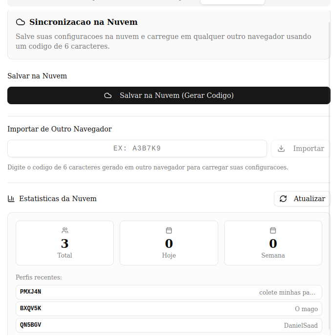
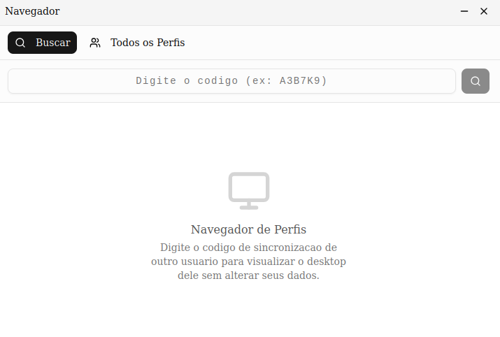
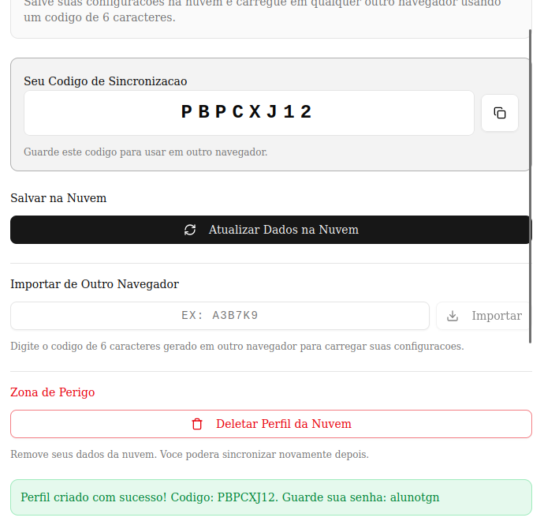
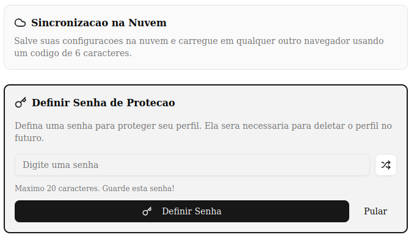
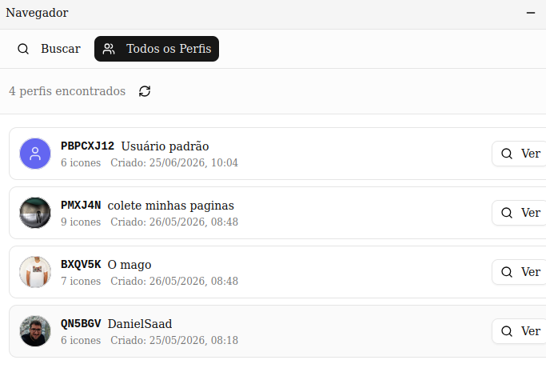
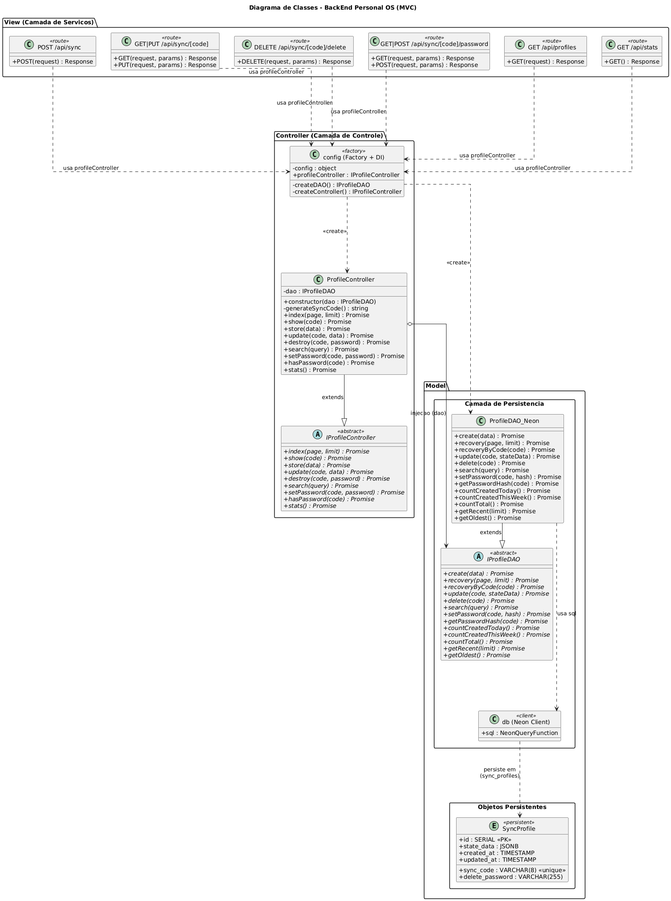

# Personal OS - Sistema Operacional Pessoal

Uma aplicação web que simula um sistema operacional pessoal com área de trabalho personalizável, ícones, janelas e sincronização na nuvem.

[](https://vercel.com)
[](https://v0.app)

---

## Link para Teste Funcional


**Aplicacao em Producao:** [https://v0-personal-os-eng-soft-2.vercel.app](https://v0-personal-os-eng-soft-2.vercel.app)


---

## Telas da Aplicacao

### 1. Tela de Boas-Vindas
- **Descricao:** Tela inicial exibida na primeira vez que o usuario acessa a aplicacao
- **Funcionalidades:** 
  - Permite definir nome de usuario
  - Escolher cor do tema
  - Opcao de carregar perfil existente via codigo de sincronizacao

### 2. Area de Trabalho (Desktop)
- **Descricao:** Interface principal do sistema operacional
- **Funcionalidades:**
  - Icones arrastáveis na area de trabalho
  - Barra de tarefas inferior com aplicativos abertos
  - Menu iniciar com lista de aplicacoes
  - Relogio e indicadores de sistema

### 3. Janelas de Aplicativos
- **Descricao:** Janelas redimensionaveis e arrastaveis
- **Funcionalidades:**
  - Minimizar, maximizar e fechar
  - Redimensionamento livre
  - Arrastar pela barra de titulo
  - Foco automatico ao clicar

### 4. Configuracoes (Settings)
- **Descricao:** Aplicativo para personalizacao do sistema
- **Funcionalidades:**
  - Alterar nome de usuario
  - Escolher cor do tema
  - Definir imagem de perfil
  - Sincronizacao na nuvem (salvar/carregar/deletar)
  - Definicao de senha para protecao do perfil

### 5. Navegador de Perfis (Profile Browser)
- **Descricao:** Aplicativo para visualizar perfis publicos
- **Funcionalidades:**
  - Lista paginada de todos os perfis
  - Visualizacao detalhada de cada perfil
  - Estatisticas gerais (total de perfis, criados hoje/semana)

### 6. Criador de Icones
- **Descricao:** Aplicativo para criar novos icones na area de trabalho
- **Funcionalidades:**
  - Definir nome, URL e icone
  - Escolher entre diversos icones disponiveis
  - Criar atalhos para sites externos

---

## Rotas REST Implementadas


### 1. Sincronizacao - Criar Novo Perfil




URL: https://v0-personal-os-eng-soft-2.vercel.app/api/sync

| Item | Valor |
|------|-------|
| **Endpoint** | `POST /api/sync` |
| **Descricao** | Cria um novo perfil de sincronizacao na nuvem |

**Request Body:**
```json
{
  "icons": [],
  "settings": {
    "username": "string",
    "themeColor": "#hexcolor",
    "profilePicture": "url"
  },
  "isWelcomeComplete": true
}
```

**Response (201):**
```json
{
  "syncCode": "ABC123"
}
```

**Erros:** `400` Dados incompletos | `500` Erro interno

---

### 2. Sincronizacao - Obter Perfil




URL: https://v0-personal-os-eng-soft-2.vercel.app/api/sync/[code]

| Item | Valor |
|------|-------|
| **Endpoint** | `GET /api/sync/{code}` |
| **Descricao** | Obtem os dados de um perfil existente |
| **Parametros** | `code` (path) - Codigo de 6 caracteres |

**Response (200):**
```json
{
  "stateData": {
    "icons": [],
    "settings": {},
    "isWelcomeComplete": true
  },
  "updatedAt": "2024-01-01T00:00:00.000Z"
}
```

**Erros:** `400` Codigo invalido | `404` Perfil nao encontrado | `500` Erro interno

---

### 3. Sincronizacao - Atualizar Perfil



URL: https://v0-personal-os-eng-soft-2.vercel.app/api/sync/[code]

| Item | Valor |
|------|-------|
| **Endpoint** | `PUT /api/sync/{code}` |
| **Descricao** | Atualiza os dados de um perfil existente |
| **Parametros** | `code` (path) - Codigo de 6 caracteres |

**Request Body:**
```json
{
  "icons": [],
  "settings": {
    "username": "string",
    "themeColor": "#hexcolor",
    "profilePicture": "url"
  },
  "isWelcomeComplete": true
}
```

**Response (200):**
```json
{
  "success": true
}
```

**Erros:** `400` Codigo invalido ou dados incompletos | `404` Perfil nao encontrado | `500` Erro interno

---

### 4. Sincronizacao - Deletar Perfil


URL: https://v0-personal-os-eng-soft-2.vercel.app/api/sync/[code]/delete

| Item | Valor |
|------|-------|
| **Endpoint** | `DELETE /api/sync/{code}/delete` |
| **Descricao** | Deleta um perfil da nuvem (requer senha se definida) |
| **Parametros** | `code` (path) - Codigo de 6 caracteres |

**Request Body (opcional):**
```json
{
  "password": "string"
}
```

**Response (200):**
```json
{
  "success": true,
  "message": "Perfil ABC123 deletado com sucesso",
  "deletedCode": "ABC123"
}
```

**Erros:** `400` Codigo invalido | `401` Senha obrigatoria | `403` Senha incorreta | `404` Perfil nao encontrado | `500` Erro interno

---

### 5. Senha - Definir Senha do Perfil




URL: https://v0-personal-os-eng-soft-2.vercel.app/api/sync/[code]/password

| Item | Valor |
|------|-------|
| **Endpoint** | `POST /api/sync/{code}/password` |
| **Descricao** | Define uma senha de protecao para o perfil |
| **Parametros** | `code` (path) - Codigo de 6 caracteres |

**Request Body:**
```json
{
  "password": "string"
}
```

**Response (200):**
```json
{
  "success": true,
  "message": "Senha definida com sucesso"
}
```

**Erros:** `400` Senha invalida ou perfil ja possui senha | `404` Perfil nao encontrado | `500` Erro interno

---

### 6. Senha - Verificar se Perfil tem Senha


URL: https://v0-personal-os-eng-soft-2.vercel.app/api/sync/[code]/password

| Item | Valor |
|------|-------|
| **Endpoint** | `GET /api/sync/{code}/password` |
| **Descricao** | Verifica se um perfil possui senha definida |
| **Parametros** | `code` (path) - Codigo de 6 caracteres |

**Response (200):**
```json
{
  "hasPassword": true
}
```

**Erros:** `404` Perfil nao encontrado | `500` Erro interno

---

### 7. Perfis - Listar Todos os Perfis



URL: https://v0-personal-os-eng-soft-2.vercel.app/api/profiles

| Item | Valor |
|------|-------|
| **Endpoint** | `GET /api/profiles` |
| **Descricao** | Lista todos os perfis com paginacao |
| **Query Params** | `page` (default: 1), `limit` (default: 10, max: 50) |

**Response (200):**
```json
{
  "profiles": [
    {
      "code": "ABC123",
      "username": "Usuario",
      "themeColor": "#6366f1",
      "profilePicture": "url",
      "iconCount": 5,
      "createdAt": "2024-01-01T00:00:00.000Z",
      "updatedAt": "2024-01-01T00:00:00.000Z"
    }
  ],
  "total": 100,
  "pagination": {
    "page": 1,
    "limit": 10,
    "total": 100,
    "totalPages": 10,
    "hasNext": true,
    "hasPrev": false
  }
}
```

**Erros:** `500` Erro interno

---

### 8. Estatisticas - Obter Estatisticas Gerais


URL: https://v0-personal-os-eng-soft-2.vercel.app/api/stats

| Item | Valor |
|------|-------|
| **Endpoint** | `GET /api/stats` |
| **Descricao** | Obtem estatisticas gerais sobre os perfis |

**Response (200):**
```json
{
  "totalProfiles": 150,
  "profilesCreatedToday": 5,
  "profilesCreatedThisWeek": 25,
  "recentProfiles": [
    {
      "code": "ABC123",
      "username": "Usuario",
      "createdAt": "2024-01-01T00:00:00.000Z"
    }
  ],
  "oldestProfile": {
    "code": "XYZ789",
    "username": "Primeiro Usuario",
    "createdAt": "2023-01-01T00:00:00.000Z"
  }
}
```

**Erros:** `500` Erro interno

---

## Estrategia Polimorfica do Projeto

O projeto implementa **polimorfismo em TypeScript** utilizando classes abstratas como contratos (interfaces) e injecao de dependencias via configuracao.

### Camadas Polimorficas

#### 1. Controllers (lib/controllers/)

**Interface base:** `IProfileController.ts`

Define os metodos do contrato:
```typescript
index()      // Lista perfis com paginacao
show()       // Busca perfil por codigo
store()      // Cria novo perfil
update()     // Atualiza perfil existente
destroy()    // Remove perfil
search()     // Busca perfis por query
setPassword() // Define senha do perfil
hasPassword() // Verifica se tem senha
stats()      // Obtem estatisticas
```

**Implementacao:** `ProfileController.ts`
- Herda de `IProfileController` e sobrescreve todos os metodos
- Delega operacoes de persistencia ao DAO injetado via construtor

#### 2. DAO - Data Access Object (lib/dao/)

**Interface base:** `IProfileDAO.ts`

Define os metodos de persistencia:
```typescript
create()           // Cria registro
recovery()         // Recupera registros paginados
recoveryByCode()   // Recupera por codigo
update()           // Atualiza registro
delete()           // Remove registro
search()           // Busca registros
setPassword()      // Define senha
getPasswordHash()  // Obtem hash da senha
countCreatedToday()    // Conta criados hoje
countCreatedThisWeek() // Conta criados na semana
countTotal()       // Conta total
getRecent()        // Obtem mais recentes
getOldest()        // Obtem mais antigo
```

**Implementacao:** `ProfileDAO_Neon.ts`
- Herda de `IProfileDAO` e sobrescreve todos os metodos
- Implementa persistencia usando Neon PostgreSQL

#### 3. Configuracao (lib/config.ts)

Arquivo central que define qual implementacao sera usada:

```typescript
const config = {
  DAO: "ProfileDAO_Neon",        // Implementacao do DAO
  Controller: "ProfileController" // Implementacao do Controller
}
```

**Polimorfismo via Configuracao:**
- Permite trocar implementacoes sem modificar codigo cliente
- Factories criam instancias baseadas na configuracao
- DAO e injetado no Controller via construtor

### Fluxo da Aplicacao

```
API Route → profileController (singleton) → DAO → Banco de Dados
     ↑              ↑                         ↑
     │         lib/config.ts             lib/config.ts
     │         (factory)                 (factory)
```

### Estrutura de Arquivos Polimorfica

```
lib/
├── config.ts                    # Configuracao e factories
├── db.ts                        # Cliente Neon
├── controllers/
│   ├── IProfileController.ts    # Interface (classe abstrata)
│   └── ProfileController.ts     # Implementacao
└── dao/
    ├── IProfileDAO.ts           # Interface (classe abstrata)
    └── ProfileDAO_Neon.ts       # Implementacao Neon
```

### Beneficios do Polimorfismo

1. **Desacoplamento:** Controllers nao conhecem detalhes de persistencia
2. **Testabilidade:** Facil criar mocks para testes unitarios
3. **Extensibilidade:** Novas implementacoes sem alterar codigo existente
4. **Configuracao:** Troca de comportamento via arquivo de config

### Exemplo de Extensao

Para adicionar suporte a outro banco (ex: Supabase):

1. Criar `ProfileDAO_Supabase.ts` que herda de `IProfileDAO`
2. Implementar todos os metodos abstratos
3. Adicionar case no factory em `config.ts`
4. Alterar `config.DAO = "ProfileDAO_Supabase"`

---

## Diagramas UML (PlantUML)

Os diagramas de projeto do BackEnd estao disponiveis em formato PlantUML no arquivo
[`docs/diagramas-backend.txt`](docs/diagramas-backend.txt) e renderizados como imagem
na pasta [`docs/images/`](docs/images/).

> Para regenerar as imagens: copie cada bloco entre `@startuml` e `@enduml` do arquivo
> [`docs/diagramas-backend.txt`](docs/diagramas-backend.txt), cole em
> [https://www.planttext.com](https://www.planttext.com) e exporte como PNG.

### Diagrama de Classes

Projeto de classes do BackEnd organizado nos pacotes MVC: **Model** (objetos persistentes
`SyncProfile` + camada de persistencia `IProfileDAO` / `ProfileDAO_Neon` / `db`),
**Controller** (`IProfileController` / `ProfileController` / factory `config`) e
**View** (rotas REST - camada de servicos). Mostra heranca (classes abstratas),
injecao de dependencia e relacoes transientes/persistentes.




### Classes Persistentes vs Transientes

- **Persistentes (Model):** `SyncProfile` — entidade mapeada para a tabela `sync_profiles` (armazenada no banco Neon).
- **Transientes (Model/Persistencia):** `IProfileDAO`, `ProfileDAO_Neon`, `db` — existem apenas em tempo de execucao para mediar o acesso aos dados.
- **Transientes (Controller):** `IProfileController`, `ProfileController`, `config` (factory) — coordenam a logica de negocio.
- **Transientes (View):** rotas REST em `app/api/**/route.ts` — expoem os servicos HTTP.

---

## Arquitetura MVC

```
┌─────────────────────────────────────────────────────────────────┐
│                          VIEW (Frontend)                        │
├─────────────────────────────────────────────────────────────────��
│  OSContext          │  SettingsApp       │  ProfileBrowser      │
│  (contexts/)        │  (components/apps/)│  (components/apps/)  │
│                     │                    │                      │
│  - syncToCloud()    │  - Aba Sincronizar │  - Buscar perfil     │
│  - loadFromCloud()  │  - Salvar/Importar │  - Visualizar estado │
│  - updateCloud()    │  - Copiar codigo   │  - Modo somente-leit.│
└─────────────────────────────────────────────────────────────────┘
                              │
                              ▼
┌─────────────────────────────────────────────────────────────────┐
│                      CONTROLLER (API Routes)                    │
├─────────────────────────────────────────────────────────────────┤
│  POST /api/sync              │  Cria novo perfil, gera codigo   │
│  GET  /api/sync/[code]       │  Busca perfil por codigo         │
│  PUT  /api/sync/[code]       │  Atualiza perfil existente       │
│  DELETE /api/sync/[code]/delete │  Deleta perfil (com senha)   │
│  POST /api/sync/[code]/password │  Define senha do perfil      │
│  GET  /api/sync/[code]/password │  Verifica se tem senha       │
│  GET  /api/profiles          │  Lista todos os perfis           │
│  GET  /api/stats             │  Estatisticas gerais             │
└─────────────────────────────────────────────────────────────────┘
                              │
                              ▼
┌─────────────────────────────────────────────────────────────────┐
│                        MODEL (Database)                         │
├─────────────────────────────────────────────────────────��───────┤
│  lib/db.ts                   │  Client Neon (sql tagged template)│
│  sync_profiles (tabela)      │  Armazena estado em JSONB        │
└─────────────────────────────────────────────────────────────────┘
```

---

## Estrutura de Arquivos das Rotas

```
app/
└── api/
    ├── profiles/
    │   └── route.ts          # GET /api/profiles
    ├── stats/
    │   └── route.ts          # GET /api/stats
    └── sync/
        ├── route.ts          # POST /api/sync
        └── [code]/
            ├── route.ts      # GET/PUT /api/sync/:code
            ├── delete/
            │   └── route.ts  # DELETE /api/sync/:code/delete
            └── password/
                └── route.ts  # GET/POST /api/sync/:code/password

lib/
└── db.ts                     # Client Neon reutilizavel
```

---

## Estrutura do Banco de Dados

### Tabela: `sync_profiles`

| Coluna | Tipo | Descricao |
|--------|------|-----------|
| `id` | SERIAL | Identificador unico (PK) |
| `sync_code` | VARCHAR(8) | Codigo de sincronizacao unico |
| `state_data` | JSONB | Dados do perfil (icones, configuracoes) |
| `delete_password` | VARCHAR(255) | Senha de protecao (opcional) |
| `created_at` | TIMESTAMP | Data de criacao |
| `updated_at` | TIMESTAMP | Data da ultima atualizacao |

---

## Tecnologias Utilizadas

- **Frontend:** Next.js 15, React 19, TypeScript, Tailwind CSS
- **Backend:** Next.js API Routes
- **Banco de Dados:** Neon (PostgreSQL Serverless)
- **UI Components:** shadcn/ui
- **Deploy:** Vercel

---

## Como Executar Localmente

1. Clone o repositorio
2. Instale as dependencias:
   ```bash
   pnpm install
   ```
3. Configure a variavel de ambiente `DATABASE_URL` com sua conexao Neon
4. Execute o servidor de desenvolvimento:
   ```bash
   pnpm dev
   ```
5. Acesse `http://localhost:3000`
